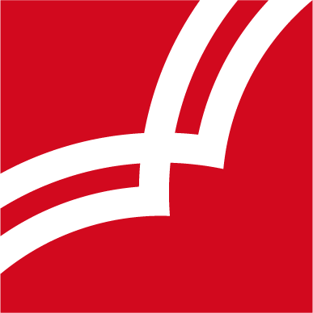

```{r setup, include=FALSE}
options(htmltools.dir.version = FALSE)
knitr::opts_chunk$set(
  fig.width = 9, fig.height = 3.5, fig.retina = 3,
  out.width = "100%",
  cache = FALSE,
  echo = TRUE,
  message = FALSE,
  warning = FALSE,
  fig.show = TRUE,
  hiline = TRUE
)
```

```{r xaringan-themer, include=FALSE, warning=FALSE}
library(xaringanthemer)
style_duo_accent(
  primary_color = "#D2202B",
  secondary_color = "#D2202B",
  inverse_header_color = "#FFFFFF",
  link_color = "#676C72",
    header_font_google = google_font("Josefin Sans")

)
```

class: title-slide, inverse, bottom
background-image: url(`r rmarkdown::metadata$url_unsplash`)
background-size: cover

# `r rmarkdown::metadata$title`

## `r rmarkdown::metadata$subtitle`

### `r rmarkdown::metadata$team`

### `r rmarkdown::metadata$date`

---
class: about-me, middle, center


## Formation continue HEP-VS

[`r icons::fontawesome("link")` Archives des séances du projet](`r rmarkdown::metadata$url_website`)</br>
[`r icons::fontawesome("user-lock")` Concept dans sa version la plus récente](`r rmarkdown::metadata$url_concept_public`)
---
class: inverse, middle left

# Ordre du jour

--

### État d'avancement général

--

### Go / No Go pour communication fin mars et démarrage formation en août 2022

--

### Nom de la formation

--

### Collaboration avec les institutions partenaires

--

### Adaptation du calendrier d’avancement du projet

--

### Divers

---

class: middle

# État d'avancement général


.pull-left[
### &#x1F7E2; Conforme à la planification
### &#x1F642; Risque faible

]

.pull-right[
### &#x1F7E0; Mis en attente
### &#x1F914; Risque potentiel

]

---

class: middle

# État d'avancement général


.pull-left[
### &#x1F7E2; Conforme à la planification
### &#x1F642; Risque faible

- Collaboration avec les associations
- Préparation des espaces de communication
- Identification des enjeux techniques (ICT-VS notamment)
- Mise en place de la structure administrative
- Affinage du design pédagogique
- Clarification des relations avec les institutions sollicitées


]

.pull-right[
### &#x1F7E0; Mis en attente
### &#x1F914; Risque potentiel

- Sécurisation du budget (pour **fin mars 2022**)
- Validation des équipes de formation (pour **fin mars 2022**)
- Validation des contenus avancés (pour **fin mars 2022**)

]

---

class: middle

# Go / No Go pour communication fin mars et démarrage formation en août 2022

---

class: middle

# Nom de la formation

---

class: middle

# Collaboration avec les insitutions partenaires

---

class: middle

# Adaptation du calendrier d’avancement du projet

--

### Tâches courantes et prochains jalons
En cas de démarrage en **août 2022**

--

- Figer les contenus (**CS** pour **fin mars**)
- Communiquer au public-cible **1** (**OES** pour **fin mars**)
- Mettre les horaires en consultation (CP pour **début avril**)
- Répartir les contenus entre équipes (**CS** pour **fin avril**)
- Communiquer au public-cible **2** (**OES** pour **fin avril**)
- Ouverture des inscriptions (**CP** pour **début mai**)

---

class: middle

# Divers


---
class: middle

.left[

```{r out.width = '10%', echo=FALSE}
# local

```

## Merci pour votre confiance.

]

--

.right[

Crédits Photos :

[Paul Skorupskas](https://unsplash.com/photos/7KLa-xLbSXA)

]
